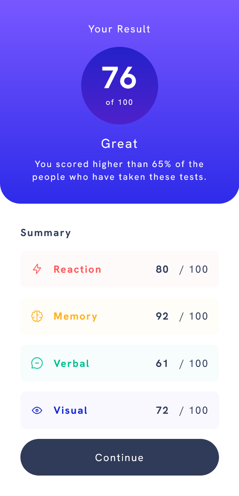

# Frontend Mentor - Results summary component solution

This is a solution to the [Results summary component challenge on Frontend Mentor](https://www.frontendmentor.io/challenges/results-summary-component-CE_K6s0maV). Frontend Mentor challenges help you improve your coding skills by building realistic projects.

## Table of contents

- [Overview](#overview)
  - [The challenge](#the-challenge)
  - [Screenshot](#screenshot)
  - [Links](#links)
- [My process](#my-process)
  - [Built with](#built-with)
  - [What I learned](#what-i-learned)
  - [Continued development](#continued-development)
  - [Useful resources](#useful-resources)
- [Author](#author)
- [Acknowledgments](#acknowledgments)

## Overview

### The challenge

Users should be able to:

- View the optimal layout for the interface depending on their device's screen size
- See hover and focus states for all interactive elements on the page
- **Bonus**: Use the local JSON data to dynamically populate the content

### Screenshot

### Links

- Solution URL: [Git Repo](https://github.com/vickbk/results-summary-component)
- Live Site URL: [Github pages](https://vickbk.github.io/results-summary-component/)

## My process

### Built with

- Semantic HTML5 markup
- CSS custom properties with Tailwindcss
- Mobile-first workflow
- [React](https://reactjs.org/) - JS library
- [Vite](https://vite.dev/) - A build tool for the web

### What I learned

In this section I have learnt how to use vite for developement and more specially how to work with it along with a React project.

### Continued development

I will keep focus on component based developement as to master its workflow.

### Useful resources

- [Roadmap](https://roadmap.sh) - Helped me get started with this journey and still leading me throughout the process
- [Frontend Mentor](https://www.frontendmentor.io) - Currently working with frontend mentor is upskilling me and I want to learn more here... Im not yet to leave

## Author

- Github - [@vickbk](https://github.com/vickbk)
- Frontend Mentor - [@vickbk](https://www.frontendmentor.io/profile/vickbk)
- Twitter - [@Vick_bk8](https://x.com/Vick_bk8)

## Acknowledgments

For this project I use most of the knowlegde I got from the frontend roadmap, frontendmentor for HTML & css tricks and technics, accessibility and various developement techniques...
